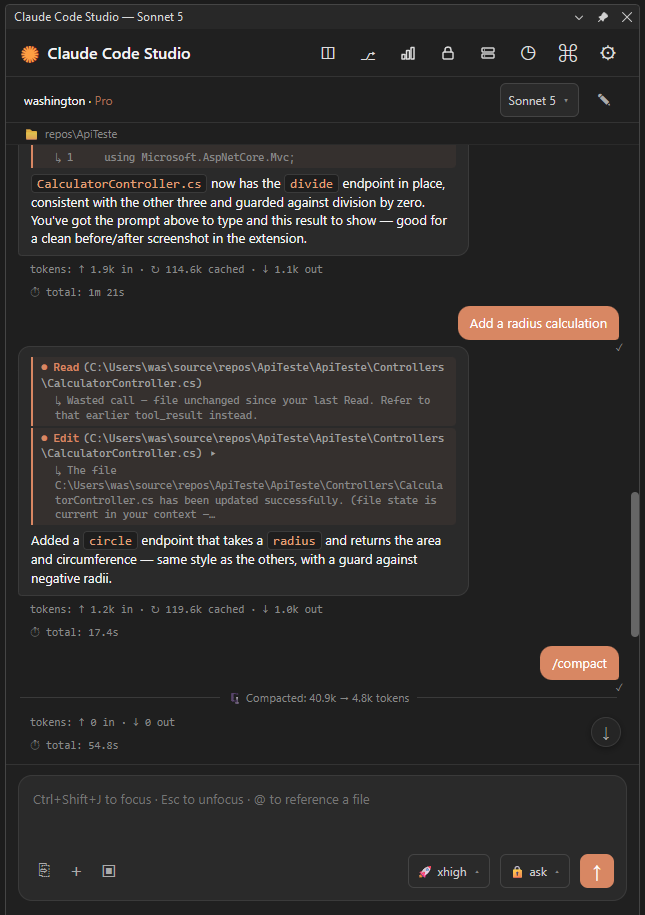

# Claude Code Studio

A native **Claude Code** chat client for **Visual Studio 2022** — a WebView2 chat panel driven by a persistent agent process that streams Claude's responses over `stream-json`, with inline permission prompts, native diffs, session history, and a usage dashboard.

Unlike terminal-embedding extensions, Claude Code Studio does **not** host a console window. It runs the `claude` CLI as a long-lived subprocess and speaks its streaming JSON protocol directly, so the whole conversation — text, tool calls, diffs, permission requests — is rendered as first-class UI instead of scraped terminal text.

<p align="center">
  
</p>

## Features

### Chat & streaming
- **Streaming chat panel (WebView2)** — Claude's replies stream in as rendered Markdown, with syntax-highlighted code fences and per-message model info.
- **Live turn indicators** — a presence line shows `✳ thinking…`, `🗜️ compacting context…`, and live `TodoWrite` / context-usage updates while a turn runs.
- **Auto-compact feedback** — when the context window is auto-compacted mid-session, a live indicator and an inline "compacted N → M tokens" divider explain what happened instead of a silent pause.
- **Subagent trace** — text and tool calls from spawned subagents (Task/Explore) are rendered nested under the parent tool chip, at an off/simple/full level you choose.
- **Font zoom** — Ctrl+Scroll zooms the whole chat; the level persists across sessions.

### Permissions & modes
- **Inline permission prompts** — tool calls that need approval surface a modal with **Allow**, **Allow for session**, and **Deny**, showing the working directory the call runs in. Backed by a `PreToolUse` hook over a named pipe, not a terminal prompt.
- **Permission modes** — switch between **ask**, **plan** (Exit Plan Mode becomes an explicit "Approve plan" modal), **bypass permissions** (yolo), and **don't ask** (read-only: reads and searches run freely, all edits are blocked by the CLI).
- **Permission rules** — allow / deny / ask rules honored per session.

### Diffs, rewind & branching
- **Native diff viewer** — Edit/Write chips open the real Visual Studio diff (`IVsDifferenceService`), inline or in a modal.
- **Rewind (⟲)** — roll a session back to an earlier point (dry-run preview, then revert).
- **Branch (⎇)** — fork the conversation from a chosen message into a new line.

### Session history
- **Per-workspace history** — list past sessions for the current folder and resume any of them in one click.
- **Rename & view** — give a session a custom title inline, or open its full transcript as Markdown before resuming.
- **Fork (↳)** — resume a session as a native fork (`--fork-session`): a brand-new session seeded with the original's history, leaving the original untouched.
- **AI-generated titles** — sessions are named automatically, with custom renames always winning.

### Composer
- **@ file picker** — type `@` to search the workspace's files and folders with keyboard-driven drill-down, and insert a path.
- **Slash commands & skills** — `/` autocompletes built-in and custom commands plus installed skills; picking a skill drops a `/name args` chip and a "Use skill" card.
- **Editor selection → prompt** — send the current editor selection as a formatted, path-and-line-annotated snippet.
- **Image & file paste** — paste images (Ctrl+V) or attach files; binaries are shared with the CLI via a temp `--add-dir`.
- **Prompt history** — browse previous prompts with Ctrl+Up / Ctrl+Down, with an `N/total` indicator.

### Usage & cost
- **Usage dashboard** — token usage and computed cost per session, with auto-refresh, model breakdown, and a filter to a single session. Cache-write pricing is split by TTL (5-minute vs 1-hour) so long sessions are costed correctly.
- **Cost limits** — a soft spend warning plus an optional hard per-session budget (`--max-budget-usd`) that stops the turn when reached.

### Command palette (⌘)
A single palette gathers on-demand tools that render as inline cards:
- **🩺 Doctor** — run `claude doctor` and show the report.
- **MCP status & reconnect** — inspect MCP servers and reconnect them.
- **Context usage** — see how full the context window is.
- **Build errors → agent** — send the current build's errors (with warnings for context) to Claude on demand, or opt in to auto-send on every failed build; duplicate error sets are de-duped to avoid loops.
- Plus live `TodoWrite`, side-question cards, and system info.

### Workspace, trust & sign-in
- **Working-directory cascade** — resolves the cwd from the open Solution → Open Folder → active document → user profile, shown in a click-to-copy path bar.
- **Trust management** — workspace and MCP-server trust gates with a management UI, backed by a trusted-workspaces store and a file-system watcher.
- **Integrated sign-in** — `claude login` runs from inside the extension with a watcher and an overlay, and the titlebar shows your account name and plan.

### Configuration
- **Settings panel** — a searchable settings UI (search matches label, tooltip, and section) that passes through the full Claude Code settings surface, with info tooltips on individual controls.
- **Model picker** — Sonnet 5 / Sonnet 4.6, Opus 4.8, Opus Plan, Fable 5, Haiku 4.5, plus an effort level (low → max; "max" is session-only).
- **Fallback model** — an optional `--fallback-model` used when the primary model is overloaded, with a divider marking when it engages.
- **Configurable CLI path** — point at a specific `claude` executable, or let detection pick it (it prefers `~/.local/bin/claude.exe` — the native installer's target — over a possibly-stale copy on `PATH`, and warns when the two diverge).
- **Status line** — an optional configurable status command rendered under the path bar.
- **Theme aware** — follows the Visual Studio light/dark theme, with an accent/override option.

## How it works

```
Visual Studio (VSIX, .NET Framework)
        │  WebView2  ⇄  HTML/CSS/JS chat UI
        │
        ▼
ClaudeStudioAgent (subprocess, .NET 10)
        │  stdin/stdout: stream-json
        ▼
   claude  (Claude Code CLI)
```

The extension hosts the chat UI in WebView2 and launches `ClaudeStudioAgent` as a persistent subprocess. The agent spawns and talks to the `claude` CLI in streaming JSON mode, translating its event stream into chat chunks and relaying permission requests back through a `PreToolUse` hook. Pure, testable logic (event parsing, pricing, session-ordinal mapping, CLI discovery) lives in `ClaudeStudioShared` and is covered by the `ClaudeStudioTests` xUnit suite.

## Requirements

- **Visual Studio 2022** 17.14 or newer (amd64)
- **Windows**
- **[Claude Code CLI](https://docs.claude.com/en/docs/claude-code/setup)** installed and on `PATH` (or configured via the CLI-path setting)
- A **Claude** subscription (Pro or higher) or API access, signed in through the CLI

## Installation

1. Build the solution (`ClaudeStudio.slnx`) in Visual Studio, or install the packaged VSIX by double-clicking it.
2. Restart Visual Studio.
3. Open the tool window via **View → Other Windows → Claude Code Studio**.
4. If you aren't signed in yet, use the in-panel sign-in to run `claude login`.

## Quick Start

1. Open a solution or folder so the extension has a working directory.
2. Pick a model (and effort level) from the model button.
3. Type a prompt and send it — replies stream into the panel.
4. Attach context with `@` (files), Ctrl+V (images), or the editor selection button.
5. When Claude wants to edit or run something, approve it inline (or switch permission mode to suit how hands-on you want to be).
6. Review edits via the diff chips; browse or resume past work from the session history.

## Building & testing

- **Solution:** `ClaudeStudio.slnx` (extension, agent, shared library, tests).
- **Run the tests:** `dotnet test ClaudeStudioTests/ClaudeStudioTests.csproj` (xUnit; covers the shared parsing/pricing/ordinal logic).

## License

Released under the [MIT License](LICENSE.txt) — free to use for personal, educational, and commercial purposes, including modification and redistribution.

**A note on data:** your prompts, attachments, and the code Claude reads are sent to the Claude Code CLI, which forwards them to Anthropic under [Anthropic's data-usage policy](https://docs.claude.com/en/docs/claude-code/data-usage). This extension stores only local state (settings, session titles, usage/perf logs) under `%LocalAppData%\ClaudeStudio\` and Claude's own `~/.claude` data; it sends nothing to any third party of its own.

*"Claude" is a trademark of Anthropic. This is an independent, unofficial extension and is not affiliated with or endorsed by Anthropic.*

## Acknowledgments

Claude Code Studio was inspired by [**ClaudeCodeExtension**](https://github.com/dliedke/ClaudeCodeExtension) by **Daniel Carvalho (dliedke)** — several UX ideas here (session rename/view, the `@` file picker, the build-errors-to-agent flow) were adopted from that project, which is likewise MIT-licensed. It takes a different architectural path — an embedded terminal supporting many agents — and is well worth checking out. Thanks, Daniel.
